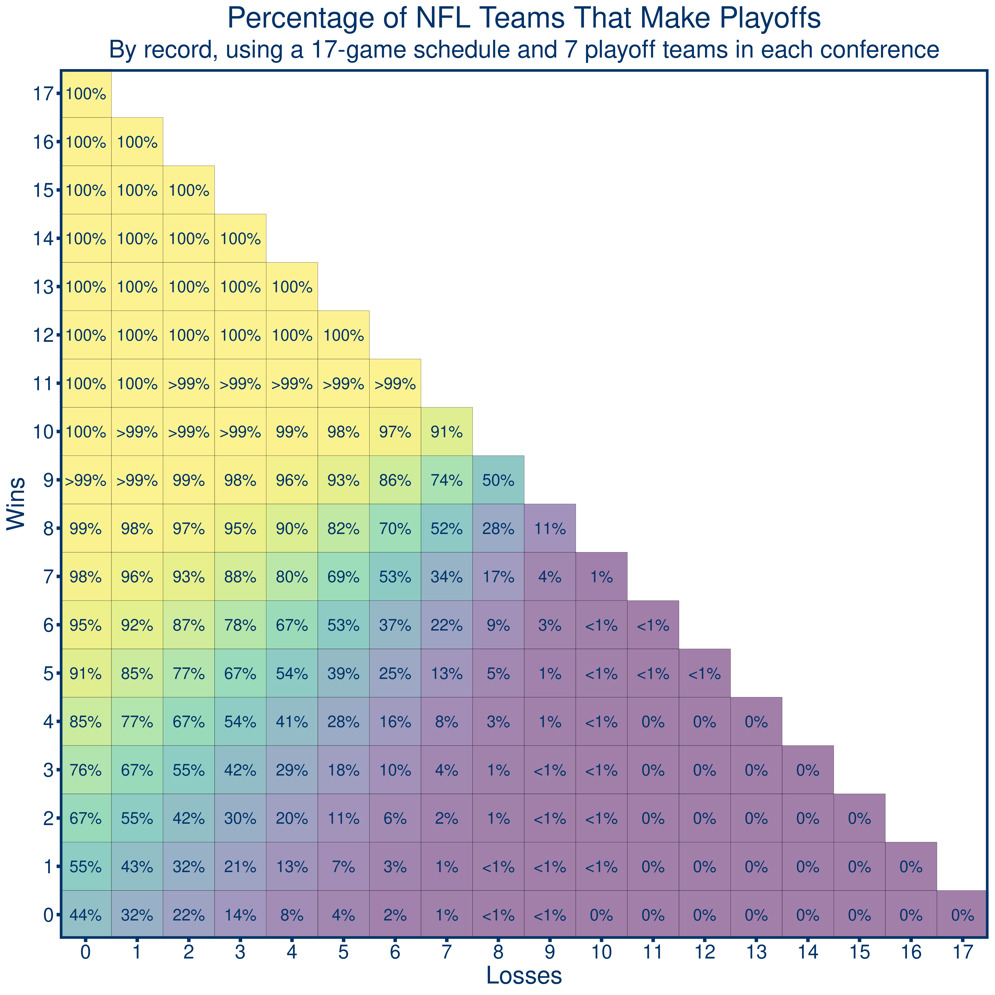

## Personal Introduction

My name is Matthew Sheridan, I'm a recent college graduate, and this is my quick, rough way of putting who I am on paper.

Now this is obviously a rough metric, with MANY assumptions made. I've sparingly worked with NFL pbp data before, so not only is this a showing of my abilities, it's also an exemplification of a journey from knowing little to being more comfortable and familiar.

If you have any further questions, I can be reached at my personal email: matthewsheridan3627\@gmail.com.

Feel free to view any of the code at "https://github.com/MatthewSheridan/NFL-Project"

## Project Introduction

Wide receivers...are weird. It is quite hard to isolate the impact that an individual receiver has over another because so many factors are different between all of them. Quarterback play, head coach, offensive schemes, opposing corner backs, and many, many more factors are difficult to be isolated with limited resources and computing power. 

To evaluate how 'clutch' a receiver is, I want to use two statistics: separation and yards after the catch. 

The first large assumption I'll be making is that yards after the catch are one of the most important things receivers can affect individually. This is a large jump, because individual skill contributes a lot to actually getting to a spot to make the catch, but the actual throw is arguably just as crucial. Thus, since a receiver-defender(s) matchup will define the YAC, using the YAC win probability added (yac wpa in this analysis) metric will be a good proxy for actual receiver outcome (considering WPA is a good baseline for evaluating how 'clutch' or important a play is). 

Now that that's out of the way, the basis for the project is being able to take the win probability added from YAC and provide in game context for it - that is it say, how important is the game in which a receiver is playing in. A game where the receiver's team has a 40% chance of making the playoffs at, say 6 and 6, is far, far more important than one at say, 14-2, where the team is already in the playoffs and what happens doesn't really affect the team's outcome. 

Then, we also want to evaluate the separation a receiver is able to get on average, adding that in as a way to quantify how good their route running is. 

Thus, we are evaluating two of the most major parts of a receiver - how good they are at getting open, and what they do once the ball is thrown at them. 

With player tracking data, we would be able to further evaluate more advanced things, such as double coverage, speed, etc, however considering that all I currently have access to is a summary of nextgen stats and play by play data, that is a future endeavor.

Ultimately, I intend for this project to showcase the way that I think, my ability to code, and hopefully provide a fun new way to at least think about receivers. Whether the actual statistic is evaluative or would hold up over time is certainly a concern, but for someone who has basically never worked with the pbp/nextgen data before, this is a start. 
## Data / Tools

In this analysis, we will be weighting YAC WPA by a function depending on the team's rough playoff probability in a specific game. For example, if the Dolphins are 3-3 and heave a 42% chance of making the playoffs, then Tyreek Hill breaking 3 tackles for a 55 yard touchdown and adding, say, 9 percent win probability to his team is ultimately more clutch than, say, Darnell Mooney doing the exact same thing but for the 1-5 bears. This relies on the assumption that the players are aware of the pressure that is on them and that they know something about how if they improve to 4-3, their playoff chances are far higher. 

Therefore, we will be using this chart to determine playoff probabilities, as it is a bit beyond my current scope to be able to incorporate every factor of playoff probability:



\newpage

Furthermore, we will be using the nflfastr play by play data, team/player information, next gen stats, contract data, and schedule data to conduct said research. Hopefully we will be able to confirm our findings with knowledge of the NFL and the 3 seasons (2020,2021,2022) in focus. 


### Data Loading / Cleaning

```{r, warning = F, message = F, echo = F}
library(tidyverse)
library(ggrepel)
library(nflreadr)
library(nflplotR)
library(coefplot)
library(dplyr)
library(rvest)
options(scipen=9999)
```


First and foremost, this requires a big shoutout to the NFLFastR guide at [this link](https://www.nflfastr.com/articles/beginners_guide.html), for giving some great code for plotting and providing variable descriptions.

The first thing I needed to do was create a searchable matrix of the playoff probabilities given any possible record. We will be excluding ties because there simply were no probabilities associated with something such as an 8-8-1 record. I want to keep this part as simple as possible.

Below is the plot of the payoff function - or the actual percent added to the yac wpa of a receiver given how important a game was to their team's success. The function was $-4 \cdot (x-0.5)^2 + 1$. This function is graphed below, with zeroes at 0 and 1 and a peak at 0.5, implying that the most important games were when a team had a 50% chance to make the playoffs, and the least important were when the team had a 0 or 100% chance. 

The way this was used was we multiplied the yac wpa by 1 plus the payoff function's value at the team's probability of  making the playoffs. For example, if the yac wpa of a reception was 0.01, and the team was at 7-4 and had an 80% chance of making the playoffs, the payoff function's value would be 0.64 and therefore our weighted yac wpa would be $1.64 \cdot 0.01$. This essentially scales up all of the yac wpa's, but way more for the more important games. 

Importantly, the clutch metric we will be creating is only valid for receivers who had next gen stats that existed for them - these receivers all had over 45 targets in 2021 and 2022, and over 43 in 2020. 

```{r, echo=F}
playoff_probs <- (matrix(c(0.44, 0.32, 0.22, 0.14, 0.08,0.04,0.02,0.01,0,0,0,0,0,0,0,0,0,0,
                        0.55,0.43,0.32,0.21,0.13,0.07,0.03,0.01,0,0,0,0,0,0,0,0,0,0,
                        0.67,0.55,0.42,0.3,0.2,0.11,0.06,0.02,0.01,0,0,0,0,0,0,0,0,0,
                        0.76,0.67,0.55,0.42,0.29,0.18,0.1,0.04,0.01,0,0,0,0,0,0,0,0,0,
                        0.85,0.77,0.67,0.54,0.41,0.28,0.16,0.08,0.03,0.01,0,0,0,0,0,0,0,0,
                        0.91,0.85,0.77,0.67,0.54,0.39,0.25,0.13,0.05,0.01,0,0,0,0,0,0,0,0,
                        0.95,0.92,0.87,0.78,0.67,0.53,0.37,0.22,0.09,0.03,0,0,0,0,0,0,0,0,
                        0.98,0.96,0.93,0.88,0.8,0.69,0.53,0.34,0.17,0.04,0.01,0,0,0,0,0,0,0,
                        0.99,0.98,0.97,0.95,0.9,0.82,0.7,0.52,0.28,0.11,0,0,0,0,0,0,0,0,
                        1,1,0.99,0.98,0.96,0.93,0.86,0.74,0.5,0,0,0,0,0,0,0,0,0,
                        1,1,1,1,0.99,0.98,0.97,0.91,0,0,0,0,0,0,0,0,0,0,
                        1,1,1,1,1,1,1,0,0,0,0,0,0,0,0,0,0,0,
                        1,1,1,1,1,1,0,0,0,0,0,0,0,0,0,0,0,0,
                        1,1,1,1,1,0,0,0,0,0,0,0,0,0,0,0,0,0,
                        1,1,1,1,0,0,0,0,0,0,0,0,0,0,0,0,0,0,
                        1,1,1,0,0,0,0,0,0,0,0,0,0,0,0,0,0,0,
                        1,1,0,0,0,0,0,0,0,0,0,0,0,0,0,0,0,0,
                        1,0,0,0,0,0,0,0,0,0,0,0,0,0,0,0,0,0),
                        nrow = 18, ncol = 18))

rownames(playoff_probs) <- 0:17
colnames(playoff_probs) <- 0:17

payoff_function <- function(x){
#  ifelse(x > 0.5, (1.5 - x + 0.5)^2, (x + 1)^2)
  -4*((x-0.5)^2) + 1 
}

playoff_probs

plot(seq(0,1,by = 0.01), payoff_function(seq(0,1,by = 0.01)),
     main = "Payoff function values per playoff probability",
     xlab = 'Playoff Probability',
     ylab = 'Extra Percent Boost to yac_wpa')

```

In the next section of code, we loaded in the team schedules to keep a rolling win count so that the model was aware of the record a team had in a given week. We then took all the passes from a particular season and merged it to add the contract value and next gen stats for the intended receiver on all passes, aggregating three metrics for use: the average weighted yac wpa per intended target, the average unweighted yac wpa per intended target, and the average epa per intended target, which was not used in the end.

\textbf{Importantly, the passes we're concerned with are regular season pass attempts to a receiver. This is because not catching the ball can have an affect on yac wpa (somehow, though I have not fully reasoned through it) and we don't want to just drop missed passes, because then we'd only be looking at passes that receivers caught which would be heavily associated with high yac wpas.}

Please see the .RMD file for all the code pertaining to this section as it is a bit dense and does not belong in a summarizing paper. 

```{r, echo = F, message = F, warning = F}
# Function for obtaining cleaned data by year specified.
get_wr_data <- function(YEARS){
  
  # Load the schedule of each team in
  schedule <- filter(load_schedules(seasons = YEARS), game_type == "REG")
  
  #initialize matrix to keep track of the wins a team has per week
  rolling_wins <- matrix(nrow = 32, ncol = 18)
  
  #sorted list of team abbreviations
  teams <- sort(unique(schedule$away_team))  
  
  # For each team, in each week, find out whether the score differential of the 
  #previous week was in their favor and if so, add a win to their running count
  # for that week. In any given week, we should know their record as a result of
  # any games up until that point.
  
  for (i in 1:32){
  cur_team <- teams[i]
    for (j in 1:18){
      #in the first week, they should have zero, otherwise initialize the current
      # week to the previous week's value
      rolling_wins[i,j] <- ifelse(j == 1, 0, rolling_wins[i,j-1] )
      tmp <- filter(schedule, (home_team == cur_team) | away_team == cur_team, week == j-1)
    
      # if the team had a game in the previous week, the current week's count 
      # will be the count from the previous week plus whether they won the 
      # previous game (1) or not (0)
      if (nrow(tmp) != 0){
        if (tmp$away_team[1] == cur_team){
            rolling_wins[i,j] <- ifelse(j>1, 
                                        (1 * (tmp$result[1] < 0)) + rolling_wins[i,(j-1)], 
                                        0)
        }
        else if (tmp$home_team[1] == cur_team){
           rolling_wins[i,j] <- ifelse(j>1, 
                                        (1 * (tmp$result[1] > 0)) + rolling_wins[i,(j-1)], 
                                        0)
        }
                
      }
    }
  }
  
  # create a dataframe from these results
  rolling_wins <- as.data.frame(rolling_wins)
  rownames(rolling_wins) <- teams
  colnames(rolling_wins) <- 1:18

  # Load pbp data for the year in question
  data = load_pbp(YEARS)
  
  #load team data for team colors in plots
  data <- data %>%
    left_join(load_teams(), by = c('posteam' = 'team_abbr'))

  # take all the active contracts and merge the dataframe of player information
  # on it by unique player names and positions
  
  contracts_with_id <- filter(load_contracts(), is_active == T) %>% inner_join(load_players()[,c('gsis_id', 'display_name', 'position')], by = join_by(player == display_name, position == position))
  
  # Load next gen stats for week 0 (entire season)
  nextgen <- filter(load_nextgen_stats(seasons = YEARS,stat_type = c("receiving"),
                     file_type = getOption("nflreadr.prefer", default = "rds")), week == 0)
  
  
  # we want regular season games where receivers were the intended target and 
  # there were yards after the catch. 
  passes <- filter(data, pass_attempt == 1, season_type == "REG")
  
  # Find the indices for the rolling count of wins for the posessing team in
  # the current week
  i <- cbind(match(passes$posteam, rownames(rolling_wins)), 
        match(passes$week, colnames(rolling_wins)))
  
  # append a column of the rolling win counts
  passes <- cbind(rolling_win_ct = rolling_wins[i], passes)
  
  # find the index of the playoff probability for the week - 1 - number of wins
  # which equals the current losses and the number of rolling wins
  # This is based on how the matrix was indexed.
  i <- cbind(match(passes$week - 1 - passes$rolling_win_ct, rownames(playoff_probs)), 
        match(passes$rolling_win_ct, colnames(playoff_probs)))
  
  # as with above, append the column of the posessing team's playoff probability 
  passes <- cbind(playoff_prob = playoff_probs[i],passes)
  
  # Count the number of passes where a receiver is the intended target.
  pass_counts <- passes %>% count(receiver_player_name, posteam, receiver_player_id, team_color)
  
  # aggregate the average epa of a receiver, unique to his name team and id
  avg_epa_wrs <- aggregate(epa ~ receiver_player_name + posteam + receiver_player_id, data = passes, FUN = mean)
  
  # weight the yac wpa of a receiver, unique to his name team and id
  passes$w_yac_wpa <- passes$yac_wpa * (1+payoff_function(passes$playoff_prob))
  
  # aggregate the average weighted yac wpa of a receiver, unique to his name team and id  
  avg_w_yacwpa_wrs <- setNames(aggregate(w_yac_wpa ~ receiver_player_name + posteam + receiver_player_id, data = passes, FUN = mean), c("receiver_player_name", "posteam", "receiver_player_id", "w_yac_wpa"))
  
  # aggregate the average UNWEIGHTED yac wpa of a receiver, unique to his name team and id
  avg_uw_yacwpa_wrs <- setNames(aggregate(yac_wpa ~ receiver_player_name + posteam + receiver_player_id, data = passes, FUN = mean), c("receiver_player_name", "posteam", "receiver_player_id", "uw_yac_wpa"))
  
  # merge all the aggregated data metrics onto one dataframe
  wr_data <- avg_epa_wrs %>% merge(pass_counts, keep=F) %>% merge(avg_w_yacwpa_wrs, keep=F) %>% merge(avg_uw_yacwpa_wrs, keep=F)
  
  # aggregate a team's total pass attempt plays
  team_pa <- aggregate(n~posteam, data = wr_data, FUN=sum)
  
  #merge the pass attempts onto the receiver metric data
  wr_data <- wr_data %>% merge(team_pa, by='posteam', suffixes = c("_player", "_team"))
  
  #merge contract data onto receiver data
  wr_data <- wr_data %>% inner_join(contracts_with_id, by = join_by(receiver_player_id == gsis_id))
  
  #merge the nextgen stats onto the data
  ng_wr_clean <- wr_data %>% inner_join(nextgen, by = join_by(receiver_player_id==player_gsis_id))
  
  #return the dataframe
  return(ng_wr_clean)
}

#assign dataframes to data from a specific year.
data_2022 <- get_wr_data(2022)
data_2021 <- get_wr_data(2021)
data_2020 <- get_wr_data(2020)


print("Example players in 2023")
set.seed(60)
head(data_2022[sample(1:nrow(data_2022), 5),
               colnames(data_2022) %in% c("posteam", "receiver_player_name", "w_yac_wpa","uw_yac_wpa","epa")],5)
```

## Results

First, we'll visualize a rough clutch versus volume/good player metric - we'll plot a receiver's weighted yac wpa vs their average expected points added (EPA). This allows us to see both who provides the best 'clutchness' vs who overall provides value on a game by game basis. Based on the 2022 data, we see a lot of low volume receivers (Cobb, Jennings, Hodgins) are quite efficient and look good by these standards, however it is Travis Kelce at the top of this list. He certainly provides the highest weighted yac wpa of all receivers, and on a game by game basis provides a lot of expected point value to the Chiefs. 

Note, the dot sizes are the player's cap percentage relative to the mean, so we can see where some higher paid players lie. 

```{r,echo=F, message = F, warning = F}

#https://www.nflfastr.com/articles/beginners_guide.html

#data for corner labels
df <- data.frame(x2=rnorm(100),y2=rnorm(100))

annotations <- data.frame(
        xpos = c(-Inf,-Inf,Inf,Inf),
        ypos =  c(-Inf, Inf,-Inf,Inf),
        annotateText = c("Bad","Efficient"
                        ,"Stop Throwing","Go-To"),
        hjustvar = c(0,0,1,1) ,
        vjustvar = c(-2,1,-1,1)) #<- adjust

data_2022 %>%
  ggplot(aes(y = w_yac_wpa, x = epa)) +
  #horizontal line with mean weighted yac wpa
  geom_hline(yintercept = mean(data_2022$w_yac_wpa), color = "red", linetype = "dashed", alpha=0.5) +
  #vertical line with mean epa
  geom_vline(xintercept =  mean(data_2022$epa), color = "red", linetype = "dashed", alpha=0.5) +
  # horizontalline at origin
  geom_hline(yintercept = 0, color = "green", linetype = "solid", alpha=0.5) +
  #vertical line at origin
  geom_vline(xintercept =  0, color = "green", linetype = "solid", alpha=0.5) +
  #add points for the WRs with the right colors
  #cex controls point size and alpha the transparency (alpha = 1 is normal)
  geom_point(color = data_2022$team_color, cex=data_2022$apy / mean(data_2022$apy), alpha = .6) +
  #add names using ggrepel, which tries to make them not overlap
  geom_text_repel(aes(label=player), max.overlaps = 12) +
  #add a smooth line fitting wpa + epa
  stat_smooth(geom='line', alpha=0.5, se=FALSE, method='gam')+
  #titles and caption
  labs(x = "Average EPA per target",
       y = "Average Weighted YAC WPA per target",
       title = "WR Clutch vs. Good",
       caption = "Data: @nflfastR") +
  #uses the black and white ggplot theme
  theme_bw() +
  #center title with hjust = 0.5
  theme(
    plot.title = element_text(size = 14, hjust = 0.5, face = "bold")
  ) +
  #make ticks look nice
  scale_y_continuous(breaks = scales::pretty_breaks(n = 10)) +
  scale_x_continuous(breaks = scales::pretty_breaks(n = 10)) +
  #add corner labels
  geom_text(data=annotations,aes(x=xpos,y=ypos,hjust=hjustvar,vjust=vjustvar,label=annotateText), color = "tomato")

```
Next, we'll get to the meat of the results. 

To develop the 'clutch' statistic, we have two components: The weighted yac wpa and the average separation. For both metrics, since they're on different scales, we'll scale them (subtract  mean, divide by standard deviation) so that they follow a normal distribution. 

Then our formula becomes:

$$C_i = w\_yac\_wpi_i + avg\_sep_i$$

In words: The 'clutch' factor of player i is equal to the sum of the scaled weighted average yards after the catch win probability for a given season plus the scaled average separation for that season.

This rewards players who help their team's win probabilities in more important games and are able to create separation overall. 

We can see that the correlations between the two scaled metrics are, for the three seasons in question, below about 0.1 in magnitude, which shows that these are somewhat separable skills, though there is something to be said about how receivers who have more separation tend to have higher yards after the catch, however this seemed to be not much of a factor here. 

Furthermore, for players who played in all three seasons, we can see that there's a correlation of about .45 for 2021 to 2020 and 0.31 for 2020 to 2021. These numbers are not great, however are not insignificant. This leads me to believe there are other factors about wide receivers which could explain more replicability in skilll year over year.

```{r, echo = F, warning = F, message = F}
#creating clutch statistic
data_2022$clutch <- scale(data_2022$w_yac_wpa) +
  scale(data_2022$avg_separation)

data_2021$clutch <- scale(data_2021$w_yac_wpa) +
  scale(data_2021$avg_separation)

data_2020$clutch <- scale(data_2020$w_yac_wpa) +
  scale(data_2020$avg_separation)


#Checking correlations

print("Correlation matrix of weighted yac wpa and average separation in 2022")
cor(data_2022[, colnames(data_2022) %in% c("w_yac_wpa", "avg_separation")])
print("Correlation matrix of weighted yac wpa and average separation in 2021")
cor(data_2021[, colnames(data_2021) %in% c("w_yac_wpa", "avg_separation")])
print("Correlation matrix of weighted yac wpa and average separation in 2020")
cor(data_2020[, colnames(data_2020) %in% c("w_yac_wpa", "avg_separation")])

dta <- data_2022 %>% 
  inner_join(data_2021, by = join_by(receiver_player_id), suffix = c("_22", "_21")) %>% 
  inner_join(data_2020, by = join_by(receiver_player_id), suffix = c("", "_20"))

print("Year over year correlation matrix of clutch metric")

#year over year clutch correlation
cor(dta[,colnames(dta) %in% c("clutch_22", "clutch_21", "clutch")])

```

Finally, we want to show plots of how receivers lineup in their clutch statistic versus their volume of targets. Players with more targets and a higher clutch statistic are overall more clutch, as they can consistently get open and make the most of plays to help their team win when they need it most. 

Players in the top left are efficient, as they make the most of the limited targets.

Players in the bottom right are inefficient, as they don't make much of their targets but still get thrown to. 

Players in the bottom left don't get many targets and are not very good. 

```{r, echo = F, message = F, warning = F}
df <- data.frame(x2=rnorm(100),y2=rnorm(100))

annotations <- data.frame(
        xpos = c(-Inf,-Inf,Inf,Inf),
        ypos =  c(-Inf, Inf,-Inf,Inf),
        annotateText = c("Bad","Fun"
                        ,"Inefficient","Clutch"),
        hjustvar = c(0,0,1,1) ,
        vjustvar = c(-0.5,1,-0.5,1)) #<- adjust

plot_clutch <- function(dataframe, yr){
  dataframe %>%
    ggplot(aes(y = clutch, x = targets)) +
    #horizontal line with mean clutch
    geom_hline(yintercept = mean(dataframe$clutch), color = "red", linetype = "dashed", alpha=0.5) +
    #vertical line with mean targets
    geom_vline(xintercept =  mean(dataframe$targets), color = "red", linetype = "dashed", alpha=0.5) +
    # horizontal line at 0
    geom_hline(yintercept = 0, color = "green", linetype = "solid", alpha=0.5) +
    #vertical line at 0
    geom_vline(xintercept =  45, color = "green", linetype = "solid", alpha=0.5) +
    #add points for the WRss with the right colors
    #cex controls point size and alpha the transparency (alpha = 1 is normal)
    geom_point(color = dataframe$team_color, cex=dataframe$apy / median(dataframe$apy), alpha = .6) +
    #add names using ggrepel, which tries to make them not overlap
    geom_text_repel(aes(label=player), max.overlaps = 6, alpha = 0.8) + 
    #add a smooth line fitting wpa + epa
    stat_smooth(geom='line', alpha=0.5, se=FALSE, method='lm')+
    geom_abline(slope = -.05, intercept = (15:-5), alpha = .25)+
    coord_cartesian(ylim = c(-5, 5))+
    #titles and caption
    labs(x = "Targets",
         y = "Clutch factor",
         title = paste("WR Clutch vs. volume", yr),
         caption = "Data: @nflfastR") +
    #uses the black and white ggplot theme
    theme_bw() +
    #center title with hjust = 0.5
    theme(
      plot.title = element_text(size = 14, hjust = 0.5, face = "bold")
    ) +
    #make ticks look nice
    #if this doesn't work, `install.packages('scales')`
    scale_y_continuous(breaks = scales::pretty_breaks(n = 10)) +
    scale_x_continuous(breaks = scales::pretty_breaks(n = 10)) +
    geom_text(data=annotations,aes(x=xpos,y=ypos,hjust=hjustvar,vjust=vjustvar,label=annotateText), color = "tomato", cex = 5)
}

plot_clutch(data_2020, "2020")

plot_clutch(data_2021, "2021")

plot_clutch(data_2022, "2022")
```
Looking at 2020, we know that Tyreek Hill played in some big moments for the Chiefs and is a monster for separation and YAC. Deebo is similar, however he only had a bit over 40 targets and therfore can't be that 'clutch.'

Thought the diagonal lines are roughly put into these plots, they show that Waller, Diggs, or Hill were all some of the most clutch receivers of the year. We mentioned Hill earlier, but this seems justified for Waller and Diggs as the raiders ended 7 and 9 so they were likely in the playoff race for a while, while the Bills ended 10 and 6 and were also probably sweating their playoff hopes for most weeks, as well as Diggs being a huge target for Josh Allen.

Next, we'll look at 2021. It seems only right that Cooper Kupp, the OPOY, comes out in the top right as the most clutch, with Tyreek Hill in the next 'tier.' Kupp needs no explanation. His Rams won the Superbowl. after going 12-5, which bodes well for Kupp playing in a lot of meaningful games. Davante Adams is no surprise with the Packers playing well, and Jefferson helping round out that third tier of receivers makes a lot of sense. Jefferson was on a Vikings team that finished 8-9 and almost made the playoffs, so it seems most every game was meaningful.

In 2022, We see Jefferson, Kelce, and Hill as the clutchest receivers, which makes a lot of sense considering Kelce is a very good receiver, Jefferson had a ton of volume on a great vikings team, and Hill put up great numbers on a team with questions at quarterback and with an uneasy route to barely squeaking into the playoffs. 

An outlier I see in this chart may be A.J. Brown, who shows up with a negative 'clutch' factor. I suspect this is due to the fact that the Eagles were borderline dominant, and a lot of their games didn't mean too much towards the end, combined with A.J. Brown not being the speedster and perfect separation receiver, who makes his money being physical and having good footwork / technical ability. 

## Discussion / Limitations

Overall, it was really cool to work with this data and be able to bring in 'industry' knowledge plus the pure fact that I watch a lot of football into this paper. Although a lot of the metrics and analysis are rough, it's cool to be able to work with big data and try something I have no experience with. 

Overall, we see a lot of the receivers regarded as clutch are on middling to good teams and take in a ton of volume of receptions.

In the future, I would love to see next gen stats be recorded for every game, as for example in 2022, the next gen stats did not cover all 17 games. Furthermore, for receivers with few receptions, they pretty much had to be dropped from the data. Even further, I hope to create a better, more encompassing metric for receiver ability, similar to ESPN in this article: "https://www.espn.com/nfl/story/_/id/34649390/espn-receiver-tracking-metrics-how-new-nfl-stats-work-open-catch-yac-scores"

Furthermore, adding a more statistically accurate "payoff function" would be a lot better. I'm not sure how accurate it was for me to say, for example, that in a game where the receiver's team has a 50% chance to make the post season, their yac wpa should count double rather than 1.25 or some other value. It was a rough function that seemed to make a lot of sense to me, and in the future I would potentially look to more accurate payoff values. 

Even further, the playoff probabilities are also rough, as they don't take the divisional context into account - having a 2-2 record in a division where the rest of the teams are 1-3 is far different than independently knowing the team has a 2-2 record. Adding a layer of context could only help. 

There were some other smaller limitations, but those were very data specific (such as having null YAC but still having a yac wpa, which I still haven't fully reasoned out).

## Concluding Remarks

Thank you for reading a small part of myself - I did not have much time to put this together and this is the result of about 8 or so hours of work that started with me learning how to use all of the datasets the NFL had to offer AND come up with an idea and test out all sorts of code, as is the data science process. My goal of this paper is to show both my curiousity and passion, as well as raw technical skills that would provide value for any club, whether it's in the NFL or other league. If you're reading this and have any questions about myself or my work, I've left my contact information at the top of this. Please don't hesitate to reach out.


\newpage

## References